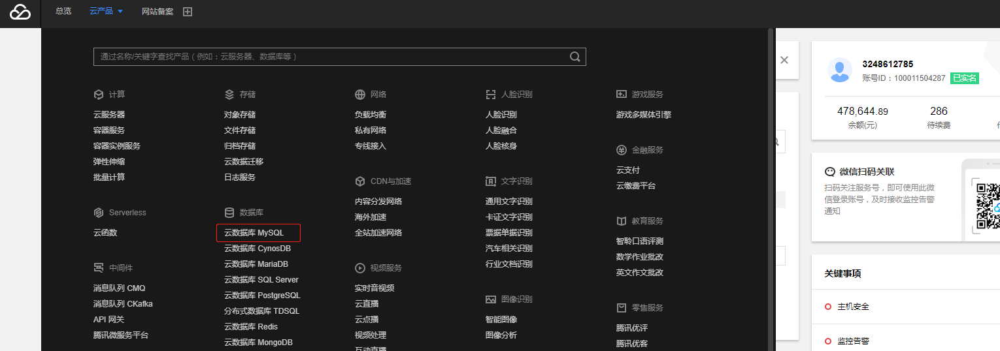

## 数据获取
由于数据量比较大，请点击下方链接进行下载数据

https://share.weiyun.com/5EUySvz

数据存放在 “决赛/data” 目录中

运行程序存放在 “决赛/sql_optimization_match” 目录中

## 登录操作

### 云服务器登录

登录云服务器方式有两种：

1、您可以通过腾讯云控制台进行登录，在控制台左上角选择云产品，选择云服务器进入CVM实例列表，点击右边登录选择 “标准登录”


2、您也可以通过SSH进行登录云服务器。

### MySQL控制台登录

登录腾讯云控制台，在控制台左上角选择云产品，选择云数据库MySQL进入CDB实例列表，点击右边登录，进行登录查看



## 操作说明
将data目录和sql_optimization_match目录通过FTP上传到您购买的服务器中

将数据导入到自己准备的MySQL数据库中，由于数据量大建议使用命令导入（假如您的数据在/root/data目录下）

您通过服务器连接MySQL（MySQL信息您可以登录腾讯云平台查看，登录方式请查看上方登录操作），命令：
```sql
    mysql -h xx(ip) -P xx(端口) -u xx(用户名) -p xx(密码) 
```
登录成功后执行命令(此步骤会耗费时间请等待)：
```sql
   1、create database dbaas character set utf8; //创建库
   
   2、use dbaas; //选择库
   
   3、source /root/data/customer.dat 
   
   4、source /root/data/nation.dat 
   
   5、source /root/data/orders.dat
   
   6、source /root/data/region.dat
```

### 答题操作
1、进入sql_optimization_match目录，该目录下有三个文件：
```sql
config_template.json 为配置模板需要复制该文件，复制名称为config.json，对config.json进行配置

introduction.txt 为操作流程文件，请参考该流程进行操作

commit_client为提交命令
```
命令操作：
```sql
cp config_template.json config.json //复制config_template.json 为 config.json

vi config.json //打开文件 进行配置您的MySQL信息

touch select1.sql select2.sql select3.sql select4.sql  //创建四个空文件

//根据下方提供的待优化SQL进行优化，分别将优化后的SQL存放在select1.sql select2.sql select3.sql select4.sql 四个文件中。

./commit_client -operator commit -sqlname select1.sql -filename select1.sql //通过此命令提交优化后的SQL，分别将四条SQL分批提交（也就是一条SQL提交一次）
```

提交成功后，您可以通过数据库智能管家DBbrain进行查看MySQL运行情况或者登录MySQL控制台进行查看MySQL运行情况

## 原表结构

```sql
    create table region  (
        regionkey  integer not null,
        name       varchar(25) not null,
        comment    varchar(152),
        primary key(regionkey)
    );

    create table nation  (
        nationkey  integer not null,
        name       varchar(25) not null,
        regionkey  integer not null,
        comment    varchar(152),
        primary key(nationkey)
    );

    create table customer (
        custkey     integer not null,
        name        varchar(25) CHARACTER SET utf8 COLLATE utf8_bin not null,
        address     varchar(40) not null,
        nationkey   integer not null,
        phone       varchar(15) not null,
        acctbal     decimal(15,2)   not null,
        mktsegment  varchar(10) not null,
        comment     varchar(117) not null,
        primary key(custkey)
    );

    create table orders  (
        orderkey       integer not null,
        custkey        integer not null,
        orderstatus    varchar(1) not null,
        totalprice     decimal(15,2) not null,
        orderdate      date not null,
        orderpriority  varchar(15) not null,  
        clerk          varchar(15) not null, 
        shippriority   integer not null,
        comment        varchar(79) not null,
        primary key(orderkey)
    );
```

## 待优化SQL语句

### select1

```sql
    select c.custkey, c.phone, sum(o.totalprice) totalprice
    from nation n 
    inner join customer c on c.nationkey = n.nationkey
    inner join orders o on o.clerk = c.name
    where n.name = "CHINA" and c.mktsegment = "HOUSEHOLD" and c.phone like "28-520%"
    group by c.custkey, c.phone
```

### select2
```sql
    select *
    from (
        select custkey, orderdate, sum(totalprice) as totalprice
        from orders
        group by custkey, orderdate
    ) o
    where orderdate = "2019-08-01"
```

### select3
```sql
    select c.custkey, sum(o.totalprice) totalprice
    from customer c 
    left join orders o on o.custkey = c.custkey
    where c.phone like "33-64%" and c.name like concat("Customer#00003", "%")
    group by c.custkey
```

### select4
```sql
    select c.custkey, c.phone
    from nation n 
    inner join customer c on c.nationkey = n.nationkey
    where n.name = "CHINA" and exists (
        select 1 from orders o where o.custkey = c.custkey and o.orderdate = "1998-08-11"
    )
```

