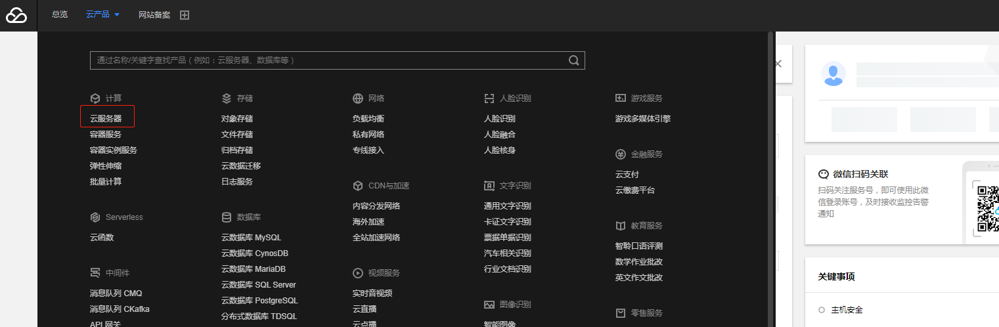
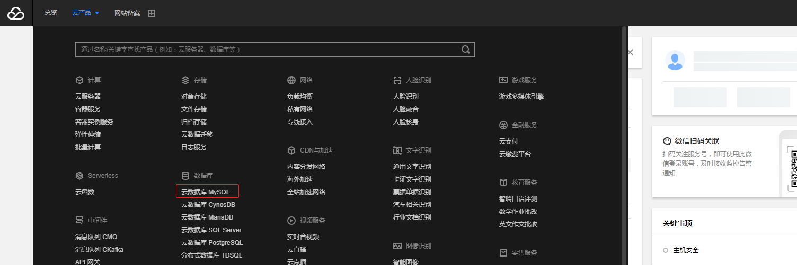
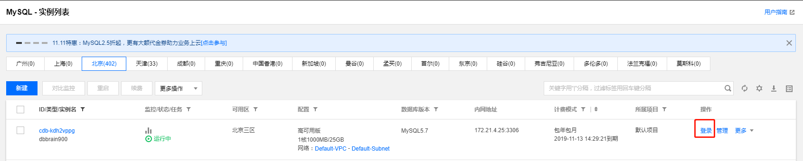

## 数据获取
由于数据量比较大，请点击下方链接进行下载数据

https://share.weiyun.com/5EUySvz

数据存放在 “初赛/data” 目录中

运行程序存放在 “初赛/sql_optimization_match” 目录中

## 登录操作

### 云服务器登录

登录云服务器方式有两种：

1、您可以通过腾讯云控制台进行登录，在控制台左上角选择云产品，选择云服务器进入CVM实例列表，点击右边登录选择 “标准登录”




2、您也可以通过SSH进行登录云服务器。

### MySQL控制台登录

登录腾讯云控制台，在控制台左上角选择云产品，选择云数据库MySQL进入CDB实例列表，点击右边登录，进行登录查看





### 数据导入

将data目录和sql_optimization_match目录通过FTP上传到您购买的服务器中

将数据导入到自己准备的MySQL数据库中，由于数据量大建议使用命令导入（假如您的数据在/root/data目录下）

您通过服务器连接MySQL（MySQL信息您可以登录腾讯云平台查看，登录方式请查看上方登录操作），命令：
```sql
    mysql -h xx(ip) -P xx(端口) -u xx(用户名) -p xx(密码) 
```
登录成功后执行命令(此步骤会耗费时间请等待)：
```sql
   1、CREATE DATABASE sql_optimization_match; //创建库
   
   2、USE sql_optimization_match; //选择库
   
   3、创建表
   
    CREATE TABLE `order` (
       `id` bigint(20) NOT NULL AUTO_INCREMENT,
       `name` varchar(32) NOT NULL,
       `creator` varchar(24) NOT NULL,
       `price` varchar(64) NOT NULL,
       `create_time` timestamp NOT NULL DEFAULT CURRENT_TIMESTAMP,
       `status` tinyint(1) not null,
       PRIMARY KEY (`id`)
     );
     
     CREATE TABLE `order_item` (
       `id` bigint(20) NOT NULL AUTO_INCREMENT,
       `name` varchar(32) NOT NULL,
       `parent` bigint(20) NOT NULL,
       `status` int not null,
       `type` varchar(12) NOT NULL DEFAULT '0',
       `quantity` int not null default 1,
       `update_time` timestamp NOT NULL DEFAULT CURRENT_TIMESTAMP,
       PRIMARY KEY (`id`)
     );
     
     4、source /root/data/data.sql  //数据导入
```

### 答题操作
1、进入sql_optimization_match目录，该目录下有五个文件：
```sql
config_template.json 为配置模板需要复制该文件，复制名称为config.json，对config.json进行配置

introduction.txt 为操作流程文件，请参考该流程进行操作

match为提交命令

select.sql和update.sql需要优化SQL代码
```

命令操作：
```sql
cp config_template.json config.json //复制config_template.json 为 config.json

vi config.json //打开文件 进行配置您的MySQL信息

touch select_commit.sql update_commit.sql //创建两个空文件

vi select.sql //查看要优化的select语句

vi update.sql //查看要优化的update语句

vi select_commit.sql //打开select_commit.sql 文件 将您根据select.sql进行优化的sql填入该文件中

vi update_commit.sql //update_commit.sql 文件 将您根据update.sql进行优化的sql填入该文件中

nohup ./match -operator commit -update update_commit.sql -select select_commit.sql & //提交优化后的sql命令，请严格按照此方法进行提交

tail -f nohup.out //查看运行情况，如果返回查询结果集正确，说明提交成功了
```

提交成功后，您可以通过数据库智能管家DBbrain进行查看MySQL运行情况或者登录MySQL控制台进行查看MySQL运行情况


## 原表结构

```sql
    CREATE TABLE `order` (
       `id` bigint(20) NOT NULL AUTO_INCREMENT,
       `name` varchar(32) NOT NULL,
       `creator` varchar(24) NOT NULL,
       `price` varchar(64) NOT NULL,
       `create_time` timestamp NOT NULL DEFAULT CURRENT_TIMESTAMP,
       `status` tinyint(1) not null,
       PRIMARY KEY (`id`)
     );
         
     CREATE TABLE `order_item` (
       `id` bigint(20) NOT NULL AUTO_INCREMENT,
       `name` varchar(32) NOT NULL,
       `parent` bigint(20) NOT NULL,
       `status` int not null,
       `type` varchar(12) NOT NULL DEFAULT '0',
       `quantity` int not null default 1,
       `update_time` timestamp NOT NULL DEFAULT CURRENT_TIMESTAMP,
       PRIMARY KEY (`id`)
     );
```

## 待优化SQL语句

### select

```sql
    SELECT *
    FROM   `order` o
           INNER JOIN order_item i ON i.parent = o.id
    ORDER  BY o.status ASC,
              i.update_time DESC
    LIMIT  0, 20
```

### update
```sql
    update `order` set
    create_time = now()
    where id in (
        select parent from order_item where type = 2
    )
```


